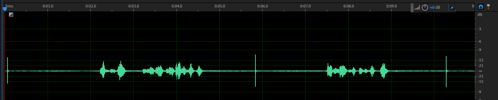

# ASGSV: Attack Sample Generation against Speaker Verification Systems.

This repository holds code to generate attack samples against speaker verification (SV) models.

It is mainly divided into three parts:
1. Training and testing the victim SV model
2. Generating the adversarial sample (digital attack)
3. Replay attack

## Training and testing the victim SV model
The Speaker Verification (SV) model is trained using the [voxceleb_trainer](https://github.com/clovaai/voxceleb_trainer).

### Models
4 models have been implemented: X-Vector, RawNet3, ECAPATDNN, and ResNetSE34V2.

Pre-trained models for RawNet3 and ResNetSE34V2 are available from the official [voxceleb_trainer](https://github.com/clovaai/voxceleb_trainer).

Pre-trained model ECAPATDNN are available from [ECAPA-TDNN](https://github.com/TaoRuijie/ECAPA-TDNN)

X-Vector model is implemented by [wespeaker](https://github.com/wenet-e2e/wespeaker/blob/master/wespeaker/models/tdnn.py), then train from scratch.

Models paths:
- RawNet3: `pretrained_models/RawNet3/model.pt`
- ECAPATDNN: `pretrained_models/ECAPATDNN/ECAPATDNN.pth`
- ResNetSE34V2: `pretrained_models/ResNetSE34V2/ResNetSE34V2.pth`
- X-Vector: `voxceleb_trainer/exps/XVector_AAM/model/model000000230.model`

### Dataset
Train on Voxceleb2, test on Voxceleb1.

## Digital attacks
The codes for digital attack are divided into two parts, generating attack samples and transfer attack.

### Adversarial example generation
Our code supports using Project Gradient Descent (PGD), FakeBob, and Iterative Ensemble Method to generate adversarial examples. 


`attack/attackMain.py` contains script to generate adversarial examples from one surrogate model. It can be configured in `attack/attack_config.py` by setting `config.attack.attack_name` to specify attack name (options are 'PGD' and 'FAKEBOB', ), `config.model.model_name` for the model, and `config.data.dataset_name` field for the dataset to use. Example configurations have been already filled in the file.
The `config.adv_sample_root` field specifies the destination of the synthesized adversarial examples.

`attack/ensemble_attack.py` contains script to generate ensemble adversarial examples from multiple surrogate models. It can be configured in `attack/ensemble_attack_config.py` by setting `config.attack.attack_name` to specify attack name, `config.model.model_name` for the model, and `config.data.dataset_name` field for the dataset to use. Example configurations have been already filled in the file. 

After configuration, the user can generate adversarial examples by running:
```bash
cd attack
python attackMain.py
cd ..
```
To synthesize ensemble adversarial sample, the user can run:
```bash
cd attack
python ensemble_attack.py
cd ..
```
and the synthesized adversarial examples are located in the `config.adv_sample_root` field specified by the user. 


After running, the log and the attack success rates information will be located in `attack/attack_exps/ASVspoof2019` folder, and in the `attack/ensamble_attack_exps/ASVspoof2019` folder for ensemble attacks.

### Transfer attack
After the synthesis of attack samples, a tranfer attack against a certain ASV system can be performed and the user can examine the attack success rates of the attack samples. 

To configure the attack, the user can modify `attack/transfer_attack_config.py`, where the `config.attack.attack_sample_dirs` field should be a list containing one or more `config.adv_sample_root` fields that have been specified when generating the attack samples. The user can specify the ASV models under attack by modifying `config.attack.defense_models`, containing the models names from 'ECAPATDNN', 'RawNet3', 'XVEC', and 'ResNetSE34V2'.

After configuration, the user can attack an ASV system by running:
```bash
cd attack
python tranferAttack.py
cd ..
```

After running, the log and the attack success rates information will be located in `attack/transfer_attack_exps/ASVspoof2019` folder.

## Physical attacks
This repository also holds utilities for recording physical attack samples and performing physical attacks.

### Clipping and recovering physical attack samples
In this stage, we use recording devices like smartphones to record the attack samples synthesized in the digital attacks. Since there could be plenty of attack samples, it is more efficient to clip them together into one long audio for replaying and recording, and then feed the recorded long audio for recovering to their original length.

The `audio_clipper` folder holds the scripts to perform such operations. To clip a list of audios, the user can provide a list of `target_paths` in line 10 containing audios to concatenate, and change line 101 for where to save the concatenated audio. 

After the setup is complete, run:
```bash
cd audio_clipper
python clipper.py
cd ..
```
and the resulting audio is located in the destination path provided, along with a metadata `pkl` object in `audio_clipper` folder.


To clip the recordings into independent audio files named with their original names before the recording, first manually clip the recorded audio so that the first pulse before the first audio segment is in the first 1 second of the exported audio clip, as shown in the figure below: 

Then, configure the `full_audio_path` in line 46 of `recover_pulse.py` to the recorded full audio, the `save_folder` in line 42 to the destination folder to save the recovered audios, and the `metadata_path` to the `pkl` object generated in the last step.
After the setup is complete, run:
```bash
cd audio_clipper
python recover_pulse.py
cd ..
```
and the recovered audios is located in the destination path provided with the same file names before they were clipped.

### Performing physical attacks
With the physical attack samples recovered in the last step, we can use them to attack ASV systems with the same procedure mentioned in the `Transfer attack` section.
